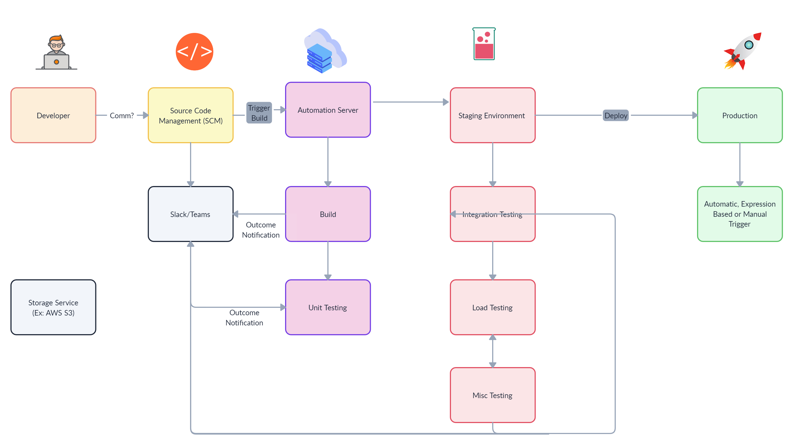

# DevOps: OpenSupports Deployment

This project demonstrates how to set up the infrastructure for the OpenSupports application using AWS CloudFormation and how to deploy the application across multiple environments using a CI/CD pipeline.

## Table of Contents
- [Overview](#overview)
- [Prerequisites](#prerequisites)
- [Project Structure](#project-structure)
- [CloudFormation Setup](#cloudformation-setup)
- [Infrastructure Resources](#infrastructure-resources)
- [Deploying with CloudFormation](#deploying-with-cloudformation)
- [CI/CD Pipeline](#ci-cd-pipeline)
- [Pipeline Flow](#pipeline-flow)
- [Pipeline Setup](#pipeline-setup)
- [Deploying OpenSupports Application](#deploying-opensupports-application)
- [Security Best Practices](#security-best-practices)
- [Cost Optimization](#cost-optimization)
- [Conclusion](#conclusion)

## Overview

This project focuses on deploying the OpenSupports application, an open-source ticket management system designed to streamline customer support and communication. The deployment leverages AWS CloudFormation to set up and manage the underlying infrastructure and AWS CodePipeline to automate the deployment across multiple environments.

## Key Objectives:
- **Infrastructure Setup:** Using AWS CloudFormation to provision necessary resources such as EC2 instances for hosting the application, RDS for managing the database, and S3 for storing static assets.
- **CI/CD Automation**: Implementing a CI/CD pipeline using AWS CodePipeline (or GitHub Actions) to automate the deployment of - **OpenSupports across three environments:** development, staging, and production.
- **Security and Cost Optimization:** Following best practices to secure the application, including data encryption and least-privilege IAM roles, while optimizing resource costs by utilizing features like Auto Scaling and Spot Instances.
- **AWS Services Used:**
- **Amazon EC2:** For hosting the OpenSupports application.
- **Amazon RDS:** To provide a managed relational database for storing support ticket data.
- **Amazon S3:** For storing static content and other application files.
- **AWS CodePipeline:** For automating the deployment process across environments.
- **Amazon CloudWatch:** To monitor application performance and infrastructure metrics.

This setup ensures a scalable, secure, and cost-effective deployment pipeline, simplifying the management and promotion of code changes through different stages of the development lifecycle.

## Prerequisites
Before starting, ensure you have the following:
- **AWS Account:** For provisioning resources like EC2, RDS, S3, etc.
- **AWS CLI:** To interact with AWS from the command line.
- **Terraform:** If you plan to manage infrastructure through Terraform.
- **GitHub:** For version control and CI/CD setup (e.g., GitHub Actions).
- **Docker:** For containerized application deployments (optional).

## Tools and Technologies Used
- **AWS CloudFormation:** Infrastructure as Code (IaC) to provision resources.
- **AWS CodePipeline:** For automating deployments.
- **EC2, RDS, S3:** Core AWS services for hosting and storing application data.
- **CloudWatch:** For monitoring infrastructure and application performance.

## AWS IAM Roles and Permissions

To execute the CloudFormation and CodePipeline processes successfully, ensure that your AWS user or IAM role has the following permissions:

- **CloudFormation Permissions:**
   - cloudformation:CreateStack
   - cloudformation:DescribeStacks
   - cloudformation:UpdateStack
   - cloudformation:DeleteStack
- **EC2 Permissions:**
   - ec2:RunInstances
   - ec2:CreateSecurityGroup
   - ec2:AuthorizeSecurityGroupIngress
   - ec2:DescribeInstances
   - ec2:TerminateInstances
- **RDS Permissions:**
   - rds:CreateDBInstance
   - rds:DescribeDBInstances
   - rds:DeleteDBInstance
- **S3 Permissions:**
   - s3:CreateBucket
   - s3:PutObject
   - s3:GetObject
- **IAM Permissions:**
   - iam:CreateRole
   - iam:AttachRolePolicy
   - iam:PassRole
- **CodePipeline and CodeBuild Permissions:**
   - codepipeline:CreatePipeline
   - codepipeline:StartPipelineExecution
   - codebuild:CreateProject
   - codebuild:StartBuild
   
Make sure to assign these permissions to an IAM role attached to your AWS CodePipeline, or directly to your user account, to avoid access issues during deployment.

## Project Structure

```plaintext 
DevOpsAssignment/
├── cloudformation/            # CloudFormation templates for provisioning resources
│   ├── vpc.yaml               # VPC, subnets, security groups, and IAM roles
│   ├── ec2.yaml               # EC2 instances setup
│   ├── rds.yaml               # RDS (MySQL) setup
│   ├── s3.yaml                # S3 bucket for static files
│   ├── iam.yaml               # IAM Roles asigining
│   └── cloudwatch.yaml        # CloudWatch monitoring setup
│   ├── main.yaml              # Parameters file 
├── .aws/                      # AWS CodePipeline configuration
│   └── codepipeline.yml           # CodePipeline configuration file
├── opensupports/              # Forked OpenSupports application code
├── README.md                  # Project documentation
└── LICENSE                    # License for the project

```

## CloudFormation Setup
Before deploying the OpenSupports application, ensure the following AWS resources will be provisioned using CloudFormation templates:
- **EC2 Instances:** Hosts the OpenSupports application.
- **RDS (MySQL):** Manages the application’s database.
- **S3 Bucket:** Stores static files (images, documents).
- **VPC, Subnets, and Security Groups:** Ensures network isolation and security.
- **IAM Roles:** Manages secure access for EC2 and RDS.
- **CloudWatch:** For application and infrastructure monitoring.

Above: AWS Resources provisioned using CloudFormation templates.


## Infrastructure Resources

The infrastructure for the OpenSupports application is provisioned using AWS CloudFormation templates. These templates define various resources that are necessary for the application to function effectively across different environments.

- **VPC:** A Virtual Private Cloud (VPC) is set up to host the application securely, isolating it from other network traffic. The VPC configuration includes public and private subnets for managing different resources.

- **EC2 Instances:** Amazon EC2 instances are provisioned to run the OpenSupports application. The instance types vary across environments (t2.micro for development, t3.micro for staging, and t3.medium for production) to balance cost and performance.

- **RDS (MySQL):** Amazon RDS is used to create and manage the MySQL database instances for each environment. The database is configured with appropriate storage and performance settings, ensuring reliability and scalability.

- **S3 Bucket:** An Amazon S3 bucket is provisioned to store static files, such as images and other assets required by the application. This provides a cost-effective and scalable solution for static file storage.

- **IAM Roles:** Specific IAM roles are assigned to the resources to ensure secure and controlled access, following the principle of least privilege. These roles facilitate communication between different AWS services while maintaining security.

- **CloudWatch:** AWS CloudWatch is set up for monitoring and logging the resources. This helps in tracking application performance, resource usage, and identifying issues proactively.

## Deploying with CloudFormation

To deploy the infrastructure defined in the CloudFormation templates, execute the following steps:

1. Launch the CloudFormation Stack: Use the AWS Management Console or the AWS CLI to create a CloudFormation stack using the main.yaml template. This template includes parameters for different environments.

- aws cloudformation create-stack --stack-name OpenSupports-dev --template-body file://cloudformation/main.yaml --parameters ParameterKey=EnvironmentName,ParameterValue=dev

2. Monitor the Deployment: Monitor the stack creation process through the AWS console or CLI. Ensure all resources are created without errors.

3. Verify Resources: Once the stack creation is complete, verify that all resources (EC2, RDS, S3, etc.) are set up as expected in your AWS account.

## CI/CD Pipeline

The CI/CD pipeline for the OpenSupports application is designed to automate the deployment process across multiple environments. This pipeline leverages AWS CodePipeline to streamline the workflow from code commit to deployment.

## Pipeline Flow
The pipeline consists of several stages:

1. Source Stage: The pipeline pulls the latest code from the GitHub repository.
2. Deploy to Development Stage: Automatically deploys the application to the development environment using CloudFormation.
3. Manual Approval Stages: Includes manual approval steps for promoting the application from development to staging and from staging to production.
4. Deploy to Staging and Production Stages: Deploys the application to the staging and production environments based on manual approvals.



## Pipeline Setup

To set up the pipeline, ensure the following configurations are in place:

- **IAM Role:** Create an IAM role with appropriate permissions for CodePipeline to interact with other AWS services.
- **CodePipeline Configuration:** Update the codepipeline.yml file with your specific configurations, including repository details, branch names, and parameter overrides for each environment.

After configuration, initiate the pipeline using the AWS CLI:

- **aws codepipeline start-pipeline-execution --name OpenSupportsPipeline**

## Deploying OpenSupports Application

The deployment of the OpenSupports application follows the stages defined in the CI/CD pipeline. Start with deploying to the development environment, followed by verification of functionality. Upon successful verification, proceed to promote the application through staging and then to production.

## Security Best Practices

Implement the following security best practices to enhance the security of the deployed resources:

- **IAM Roles with Least Privilege:** Ensure that IAM roles assigned to services and users only have permissions necessary for their functions.
- **Data Encryption:** Utilize encryption for data at rest and in transit, including RDS and S3 storage.
- **Network Security:** Use security groups and network access control lists (NACLs) to restrict traffic to and from resources.

## Cost Optimization

To optimize costs, consider the following strategies:

- **Auto Scaling:** Enable Auto Scaling for EC2 instances to dynamically adjust capacity based on demand.
- **Spot Instances:** Use Spot Instances for non-production environments to significantly reduce costs.
- **Resource Cleanup:** Regularly review and delete unused resources to avoid unnecessary charges.


## Conclusion

The deployment of the OpenSupports application using AWS CloudFormation and a CI/CD pipeline significantly enhances efficiency, consistency, and scalability across environments. By following the outlined infrastructure setup and security best practices, organizations can ensure a robust deployment while optimizing costs. This approach not only simplifies the management of resources but also streamlines the application lifecycle, enabling quicker releases and improved application performance.

